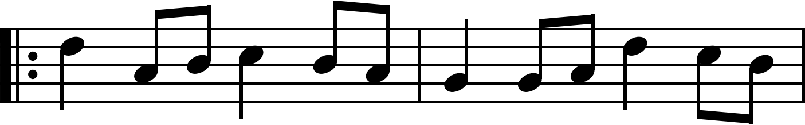
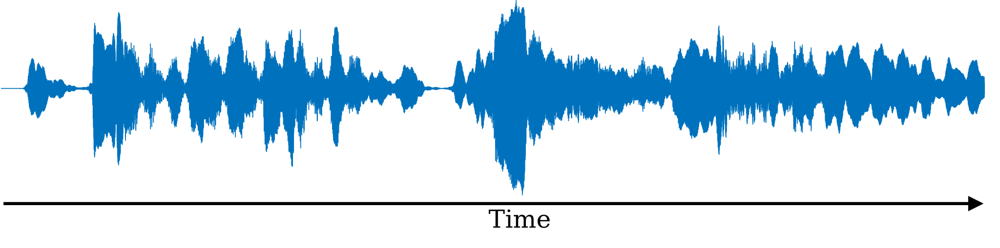
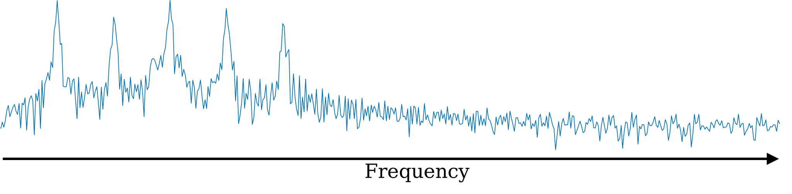

# Time-Frequency Analysis

The most ubiquitous form of time-frequency analysis can be observed in modern musical notation.

Imagine that instead of this notation, we used a purely time-domain description that describes the shape of the acoustic waveform.

Although the musician might be able to make out the rhythm and intensity clearly, it would be incredibly difficult to determine exactly which notes to play.

Now imagine that we used a purely frequency domain description, e.g. the Fourier transform.

This would show which notes to play, but it would be impossible to know when to play them.

For most audio applications neither the time-domain nor the frequency domain representations are sufficient.

Consider two more examples:

1. Bird chirping

2. Ping from marine sonar system
<video width="740" height="400" style="float: right;" controls src="_static/chirp.mp4" />"

<video width="740" height="400" style="float: right;" controls src="_static/ping.mp4" />"

Although all three representations (time-domain, frequency-domain, and joint time-frequency) contain equivalent information, it is clear that the joint representation has several advantages.

Before we can dig deeper, we must take a step back and understand how time-frequency distributions like the ones above are constructed.

## The short-time Fourier transform

Other than musical notation, the most common method for constructing a time-frequency distribution is the magnitude spectrogram, which is in-turn computed using the short-time Fourier transform (STFT)

To perform the STFT, we first divide the signal into (possibly overlapping) segments. The Fourier transform is computed independently for each segment, resulting in a two dimensional distribution.

Since the Fourier transform is, in general, complex-valued, we rarely use the STFT directly. Instead, it is common to separate it into it's magnitude and phase. The plot constructed from the magnitude of the STFT is called the magnitude spectrogram.

## Filter banks

Although the STFT has become ubiquitous for analyzing audio, another method existed long before computers and fast Fourier transform algorithms.

Much of the theory of time-frequency analysis was developed by Helmholtz, who built what would now be considered an analog 'spectrum analyzer'. At its core, it consists of an array of filters, each of which respond to a narrow range of frequencies.

The Haar decomposition can be considered a two-channel filter bank that decomposes the signal into a high-pass and a low-pass component. By recursively application of this process, we can divide the signal into arbitrarily many bands while maintaining a simple process to recover the signal. This is another way to construct a time-frequency distribution, and is the simplest example of a discrete wavelet transform.